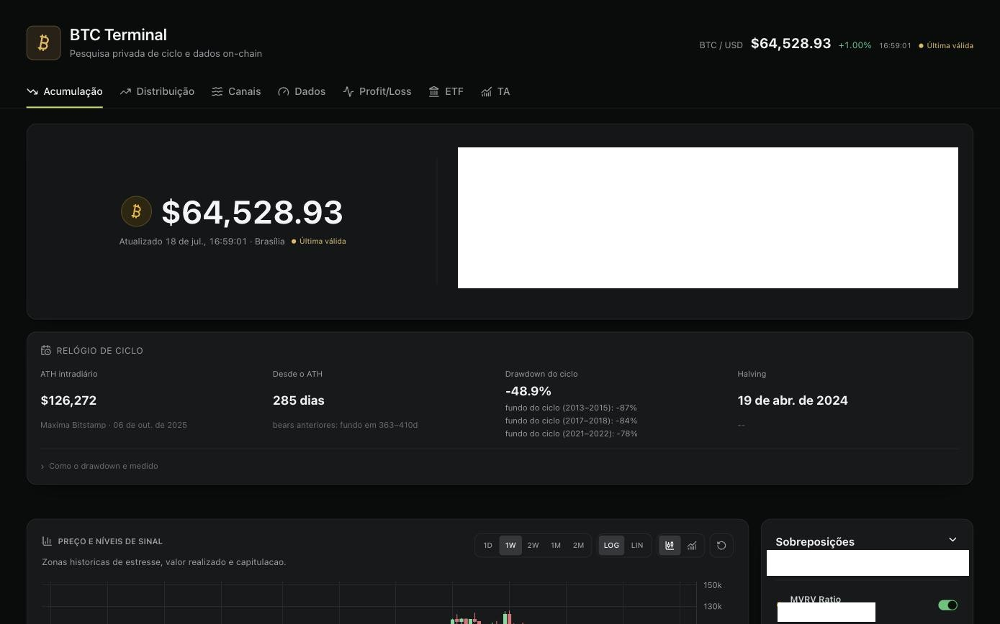
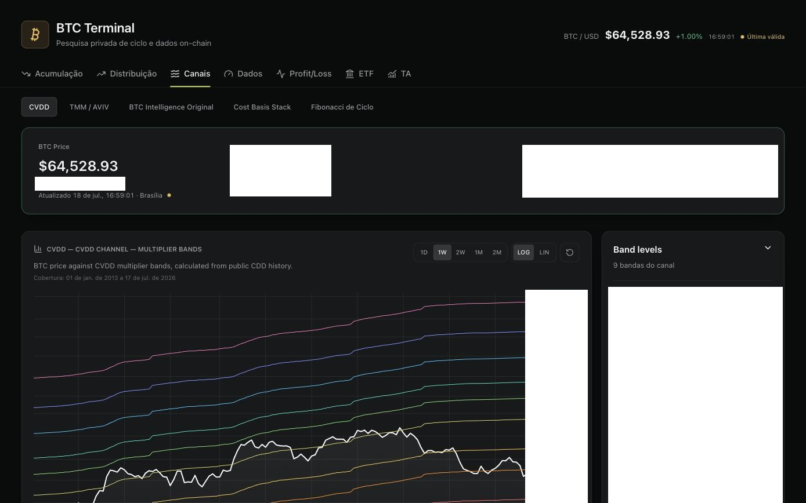
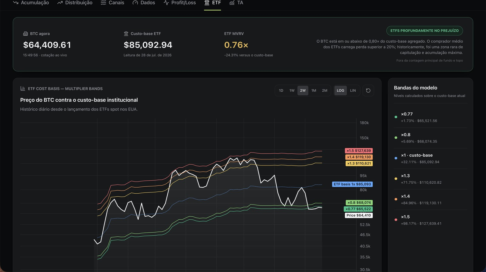

# BTC Terminal

Plataforma de inteligência de ciclo do Bitcoin: indicadores on-chain de fundo e topo, estatística histórica por episódio, canais de valuation e um arquivo imutável de snapshots para análise point-in-time.

> Estudo pessoal de dados e engenharia. Não é recomendação financeira, não executa ordens e não gerencia capital.

**Este repositório é um estudo de caso.** O código-fonte é privado. O que está aqui é a descrição do problema, das decisões de arquitetura e dos controles de qualidade — o suficiente para avaliar o trabalho sem publicar a implementação.

---

## O problema

Indicadores on-chain de Bitcoin são amplamente publicados, mas quase sempre consumidos de um jeito que não sobrevive a escrutínio:

- **Limiar fixo envelhece.** Os picos de MVRV a cada ciclo foram 5.98 → 4.60 → 3.96 → 2.77. Um alerta calibrado em 2017 nunca mais dispara.
- **Dado revisado contamina o retrovisor.** Séries on-chain são revisadas. Avaliar um sinal com a série de hoje mede algo que ninguém poderia ter visto na época.
- **Métrica isolada não tem denominador.** "MVRV está baixo" não diz nada sem: quantas vezes isso ocorreu antes, e o que aconteceu depois.

O BTC Terminal existe para tratar esses três problemas como problemas de engenharia de dados, não de opinião de mercado.

---

## Capturas

**Painel de acumulação** — score de confluência, relógio de ciclo e níveis de sinal sobre o preço.



**Canais de valuation** — preço contra bandas multiplicadoras de CVDD, com cobertura desde 2013.



**Posicionamento de ETF** — preço contra o custo-base agregado da coorte institucional.



---

## O que a plataforma entrega

**Acumulação e distribuição.** Conjunto de indicadores on-chain de fundo e de topo, cada um classificado em faixas de intensidade, com score de confluência entre eles. As métricas de base são públicas e documentadas (MVRV, STH/LTH MVRV, Mayer Multiple, LTH SOPR, AVIV/TMM, CVDD, Realized Price, supply em lucro, Terminal Price). A calibração das faixas e a composição do score são a parte proprietária e não estão descritas aqui.

**Motor de probabilidades por episódio.** Para cada limiar, o sistema identifica ocorrências históricas, deduplica episódios contíguos e reporta a distribuição de retorno em horizontes de 90, 180 e 365 dias, além da excursão adicional após a entrada. Quando não há dado futuro suficiente para fechar um horizonte, ele simplesmente não é reportado — nunca é estimado.

**Lente de percentil rolling.** Régua adaptativa que reposiciona cada métrica contra sua própria distribuição recente, corrigindo o decaimento de limiar entre ciclos. Calculada point-in-time: em cada data, só usa dados disponíveis até aquela data.

**Canais de valuation.** Bandas derivadas de modelos de custo-base, compass multi-modelo com ledger permanente de toques (incluindo wicks intradiários), cost basis stack e retração do último bull.

**Relógio de ciclo.** ATH intradiário, drawdown corrente contra fundos de ciclos anteriores, halvings passado e projetado.

**Regime de liquidez e crédito.** Modelo próprio que resume cinco famílias macro (liquidez líquida do Fed, NFCI, crescimento de M2, pressão do dólar, spread de crédito) em um score de regime. Cada série é convertida em score rolling contra sua própria distribuição plurianual; o composto exige um mínimo de componentes presentes e renormaliza os pesos apenas entre os disponíveis, em vez de tratar ausência como zero. Entra como contexto — nunca como gatilho de sinal.

**Posicionamento de ETF.** Módulo institucional independente que estima o custo-base agregado da coorte compradora dos ETFs spot americanos e mede o preço contra esse custo-base, com bandas de regime e confirmação por fluxo líquido em janelas móveis. Fica deliberadamente **fora** do score principal: o histórico começa em janeiro de 2024 e os dados públicos são revisados, então não há amostra para tratá-lo como validado.

**Arquivo imutável.** Todo snapshot publicado é preservado com verificação sha256 e indexado. É a base para replay e para backtest walk-forward sem lookahead.

---

## Decisões de engenharia

### Correção point-in-time como invariante, não como cuidado

Toda razão histórica usa preço e métrica **do mesmo dia**. Dividir um snapshot antigo pelo ticker atual é o erro mais fácil de cometer e o mais difícil de perceber depois — o resultado parece plausível e infla sistematicamente o backtest. O sistema trata isso como invariante de dados, verificado em teste, não como disciplina de quem escreve o código.

### Fonte indisponível é um estado, não um zero

Quando um provedor falha, o campo vira `unavailable` e propaga como tal até a interface. O cache pode servir o último valor válido durante uma falha temporária, **preservando a data original do dado** — o painel mostra que o número é de ontem, em vez de fingir que é de hoje. Nenhum valor é interpolado ou preenchido.

### Reconstrução histórica só entra se passar no backtest

A série TMM/AVIV tem observação pública apenas a partir de 2022. O trecho 2013–2022 é reconstruído pela metodologia Cointime a partir de fontes públicas. Essa reconstrução **só vai a produção** se atender, contra a série observada no período de sobreposição:

| Critério | Limite | Medido (16/07/2026) |
|---|---|---|
| Dias de sobreposição | ≥ 365 | 1.401 |
| Erro percentual mediano | ≤ 3% | 1,37% |
| p95 | ≤ 8% | 1,52% |
| Erro mais recente | ≤ 5% | 0,69% |

Onde há dado observado, o observado prevalece sobre a reconstrução. Nenhum multiplicador de calibração é aplicado para forçar o encaixe.

### Contrato de payload validado em runtime

Cada domínio valida seu contrato antes de chegar ao estado do React. Um snapshot malformado não renderiza um gráfico errado — ele falha visivelmente. O custo é código de validação a mais; o benefício é que um bug de dados nunca vira uma leitura de mercado silenciosamente errada.

### Validação estatística que assume a fragilidade da amostra

Séries financeiras sobrepostas quebram as premissas dos testes usuais: avaliar retorno futuro de 365 dias em observações diárias produz milhares de amostras que não são independentes, e a significância aparente é ilusória. A validação do modelo de regime foi construída em torno desse problema:

- Correlação de postos de Spearman entre score e retorno futuro em 90, 180 e 365 dias.
- **`effective_n`** — tamanho amostral efetivo, para não reportar significância inflada por janelas sobrepostas.
- **Bootstrap em blocos**, preservando a autocorrelação das séries.
- **Walk-forward anual** com janela de treino expansiva.
- Comparação entre peso igual, peso de produção e peso recalibrado — para expor quanto do resultado vem da calibração e quanto vem do sinal.
- Decomposição por ciclo de halving, já que agregar ciclos esconde heterogeneidade.
- Cada artefato de validação carrega a versão do modelo e o SHA-256 dos dados usados.

A conclusão desse trabalho foi classificar o modelo como `exploratory_walk_forward` — **não** como validado. Walk-forward separa treino e teste, mas não remove viés de revisão retroativa, o histórico macro usa a última revisão do FRED em vez de vintages ALFRED, e o Bitcoin tem poucos ciclos realmente independentes. Retornos condicionais reportados não incluem custo nem slippage, e diferença entre regimes não prova causalidade.

### Registro de modelos com estado explícito

Cada modelo estatístico tem ficha técnica versionada, com fórmula, fontes, validação e limitações. Mudar peso, componente ou limiar exige nova versão. E há uma regra que considero a mais importante do projeto:

> Uma hipótese sem backtest permanece `research` e não entra silenciosamente no score.

Backtest sobre dados revisados é marcado `exploratory` mesmo quando usa walk-forward. A separação entre "ideia interessante" e "indicador validado" é estrutural, não editorial.

### Separação de confiança entre coleta e apresentação

A coleta roda em job agendado, fora do servidor web. O frontend não fala com nenhum provedor externo e não carrega chave de API. Todo dado on-chain chega por snapshot já validado e verificado por hash.

---

## Arquitetura

```
Job agendado (diário)
  └─ backend Python: coleta fontes públicas, calcula indicadores
     e estatística de episódios, valida o pacote
        └─ publica snapshot versionado + índice sha256
              │
              ▼
     armazenamento de objetos (somente leitura para o app)
              │
              ▼
  Next.js ── proxy próprio com verificação de integridade ── UI
```

Sem cron no servidor web. Sem credencial de provedor no cliente. O painel é consumidor de um artefato imutável, não orquestrador de coleta.

---

## Stack

**Backend de dados:** Python, FastAPI, um módulo adaptador por fonte, com timeout, cache coerente com a cadência da fonte e fallback encadeado.

**Frontend:** Next.js, TypeScript, React, gráficos com sincronização de painéis e viewport compartilhado.

**Infra:** publicação agendada via CI, armazenamento de objetos, deploy serverless.

**Fontes públicas:** Bitstamp (preço e candles), BGeometrics, Open Bitcoin Metrics, Bitview/BRK, Coin Metrics Community, FRED. Todas sem chave obrigatória, todas rastreáveis. Nenhum endpoint privado, nenhum scraping de área paga.

---

## Qualidade

- **60 arquivos de teste** — 23 no frontend (node:test), 37 no backend (unittest).
- Varredura de segredos no pipeline de qualidade, com teste dedicado.
- Propriedade point-in-time do motor de episódios coberta por teste.
- Publicação atômica com verificação sha256 de ponta a ponta.
- Contratos de API testados nos dois lados da fronteira.
- Baseline de engenharia versionado: as invariantes acima estão escritas, não apenas praticadas.

---

## O que não está neste repositório

- Código-fonte do backend, do frontend e da publicação.
- Calibração das faixas de intensidade e composição do score de confluência.
- Pesos do modelo de regime de liquidez.
- Parâmetros do motor de episódios e da lente de percentil.
- Fichas técnicas completas dos modelos, incluindo os que seguem em pesquisa.
- Qualquer configuração de deploy, segredo ou detalhe do controle de acesso.

O repositório de trabalho é privado e permanece assim.

---

## Status

Em operação contínua, com publicação diária automatizada. Usuário único. Em desenvolvimento ativo.

**Próximos passos:** score composto condicionado a regime; modo replay sobre o arquivo de snapshots; backtest walk-forward com embargo; NUPL e Puell Multiple; alertas de toque de linha.

---

## Limitações que reconheço

- Estatística de episódio em Bitcoin trabalha com amostra pequena — são poucos ciclos completos. Toda probabilidade reportada carrega essa fragilidade, e o número de episódios é exibido junto ao resultado por isso.
- Séries on-chain de terceiros são revisadas; o arquivo de snapshots mitiga, mas não elimina, o efeito de revisão sobre estudos anteriores ao início do arquivo.
- Reconstrução histórica, mesmo validada, não é observação.
